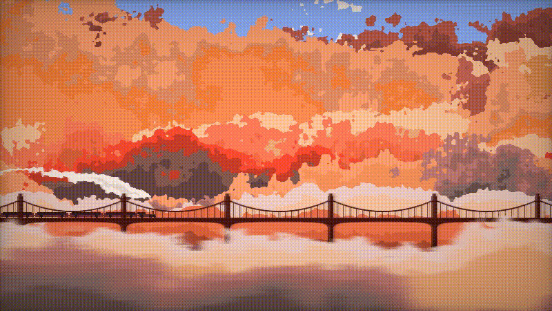

# Journey Original



The default visual state keeps the reconstructed Shadertoy pipeline intact:

- **Buffer A iChannel0:** the exact uploaded 1024×1024 noise PNG, **Linear + Repeat + VFlip ON**.
- **Buffer A iChannel1:** the previous Buffer A frame, **Linear + Clamp + VFlip OFF**, using true ping-pong render targets.
- **Buffer A feedback:** `mix(current, previous, 0.3)` by default.
- **Image iChannel0:** current Buffer A, **Linear + Clamp**, followed by the original vignette.
- Offscreen Buffer A uses `rgba16float` so temporal accumulation is not forced through an 8-bit intermediate.

## Added controls

- Start / stop the train journey (freezes the Shadertoy scene clock without stopping the renderer).
- Travel speed from 0.10× to 2.50×.
- Smooth shader-driven mood palettes: Original, Ember, Blue Hour, Sakura, Monsoon, Night Rail.
- Auto-cycle moods with animated transitions.
- Mood intensity.
- Temporal feedback amount.
- Vignette strength.
- Reset journey / feedback history.
- PNG capture.
- HUD toggle and keyboard shortcuts.

### Keyboard

- `Space`: start / stop train
- `M`: next mood
- `H`: show / hide HUD
- `R`: reset journey

## Run

```bash
npm install
npm run dev
npm run preview
```

## License

See [MIT](LICENSE).
